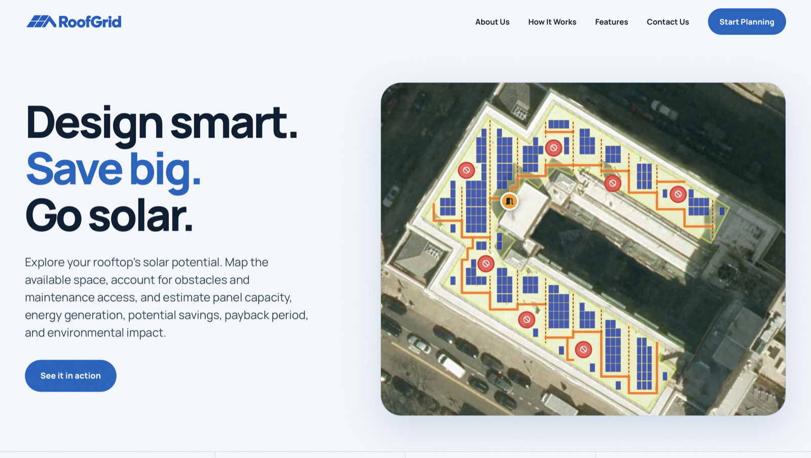
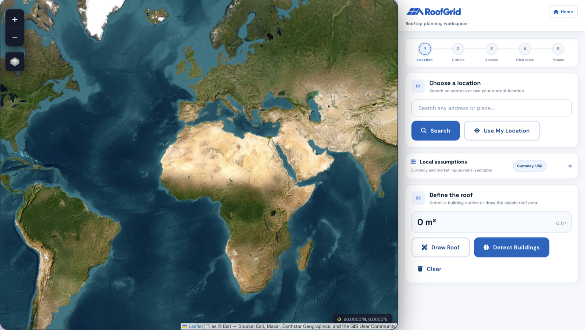
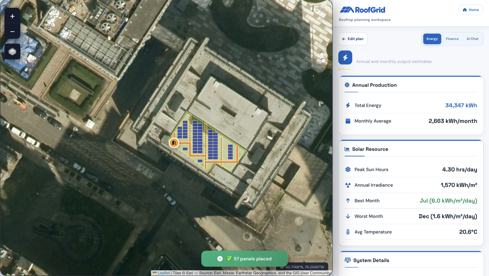
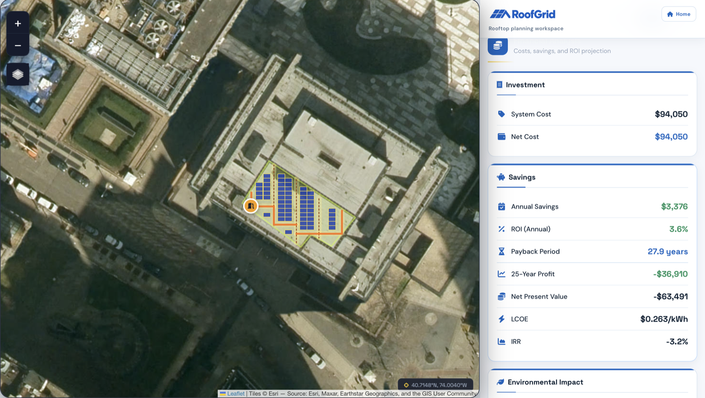
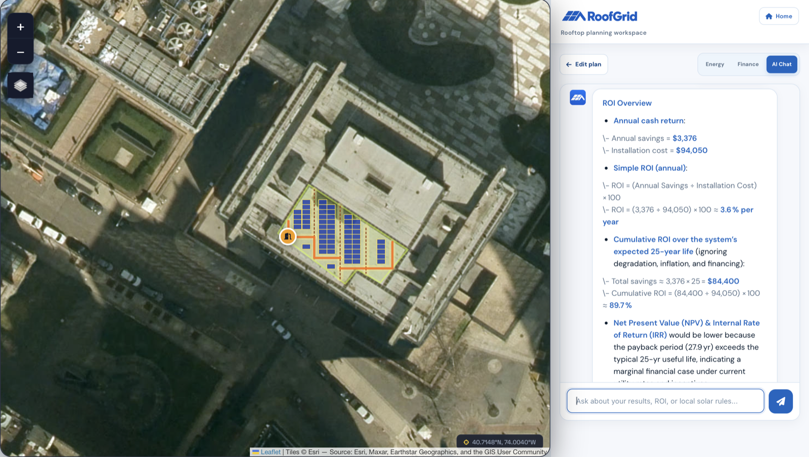

<p align="center">
  
</p>

<p align="center">
  <strong>Turn a real rooftop into a practical, access-aware solar plan.</strong>
</p>

<p align="center">
  Locate a roof, map usable space, place panels, and explore energy, financial, and environmental outcomes in one workflow.
</p>



## Why RoofGrid

Early solar estimates often start and end with a panel count. RoofGrid adds the real constraints that determine whether a rooftop plan is usable: roof geometry, access routes, maintenance space, obstacles, and editable local assumptions.

The result is an early-stage planning workspace that helps property owners, designers, students, and sustainability teams understand a roof's solar potential before moving to detailed engineering.

## From rooftop to decision

1. **Locate** — search globally, use your current location, or navigate directly on the satellite map.
2. **Define** — detect a building footprint or draw the usable roof boundary yourself.
3. **Plan** — reserve rooftop access and maintenance paths, mark obstacles, and configure the panel layout.
4. **Estimate** — review expected generation, system size, cost, savings, payback, and environmental impact.
5. **Explain** — use the optional AI assistant to explore results and identify questions for local professionals.

### Find and define a rooftop



### Review energy potential



### Explore financial outcomes



### Ask questions about the plan



## Core capabilities

- Worldwide satellite mapping, address search, and GPS support
- OpenStreetMap building-footprint detection and manual roof drawing
- Access points, maintenance paths, and obstacle exclusion zones
- Configurable panel dimensions, spacing, orientation, and layout density
- NASA POWER solar-resource and temperature data with bundled regional fallbacks
- Editable currency, tariffs, export credit, installation cost, usage, and grid-emissions assumptions
- Energy, financial, and environmental estimates in one planning workspace
- Optional Groq-powered AI assistant and downloadable PDF reports

## Environmental impact and the SDGs

RoofGrid is designed to support better early decisions about distributed solar. It can help users compare how much clean electricity a rooftop may generate, understand whether a layout is practical, and estimate avoided grid emissions using transparent, editable assumptions.

This work aligns with four United Nations Sustainable Development Goals:

| Goal | How RoofGrid contributes |
| --- | --- |
| [SDG 7 — Affordable and Clean Energy](https://sdgs.un.org/goals/goal7) | Makes rooftop renewable-energy potential easier to explore and supports informed investment in solar generation. |
| [SDG 11 — Sustainable Cities and Communities](https://sdgs.un.org/goals/goal11) | Helps evaluate existing urban rooftops as distributed-energy sites while accounting for safe access and maintainability. |
| [SDG 12 — Responsible Consumption and Production](https://sdgs.un.org/goals/goal12) | Encourages efficient use of available roof area and exposes the material, energy, and financial assumptions behind a proposed system. |
| [SDG 13 — Climate Action](https://sdgs.un.org/goals/goal13) | Estimates potential avoided emissions so users can compare rooftop solar scenarios as part of broader decarbonization planning. |

RoofGrid reports estimated annual and lifetime energy generation, avoided CO₂e, and simple environmental equivalents. These values are decision-support estimates—not audited carbon accounting, verified emissions reductions, or certification of SDG performance.

In practical terms, the planner helps quantify:

- how much of a roof can be used without ignoring access and obstacle constraints;
- the renewable electricity a proposed layout may produce;
- the share of local electricity use that solar could cover; and
- the potential emissions avoided under an editable grid-emissions assumption.

## How the estimates are built

| Area | Source or method |
| --- | --- |
| Map and geometry | Leaflet, Esri World Imagery, OpenStreetMap, and Turf.js |
| Solar resource | NASA POWER API with bundled regional fallback data |
| Layout | Browser-based geometry using the selected roof, exclusions, access path, and panel settings |
| Finance | User-editable cost, tariff, export-credit, usage, degradation, and discount assumptions |
| Environmental impact | Estimated generation multiplied by an editable grid-emissions factor |
| AI | Optional server-side OpenAI-compatible chat proxy, configured for Groq by default |

## Run locally

Requirements: Python 3.9 or newer and a modern browser.

```bash
git clone git@github.com:rohanmalhotracodes/roofgrid.git
cd roofgrid
cp .env.example .env.local
python3 server_local.py
```

Open <http://localhost:8000>. Use `server_local.py` rather than opening the HTML files directly because RoofGrid's AI, OpenStreetMap, contact, and NASA requests use private proxy routes.

### Environment variables

Only the relevant private values need to be added to `.env.local`:

```dotenv
GROQ_API_KEY=gsk_your_real_key
CONTACT_EMAIL=you@example.com
```

`GROQ_API_KEY` enables AI chat. `CONTACT_EMAIL` routes contact-form messages through FormSubmit; the recipient may need to confirm FormSubmit's one-time activation email. Provider, model, and other optional AI settings are documented in `.env.example`.

Never put real credentials in `.env.example`, frontend JavaScript, or any committed file. Restart the local server after changing `.env.local`.

## Deploy to Vercel

1. Import this repository into Vercel and select the **Other** framework preset.
2. Leave the build, output, and install commands empty; `vercel.json` contains the required routes.
3. Add `GROQ_API_KEY` and `CONTACT_EMAIL` under **Production and Preview** environment variables.
4. Add any optional AI provider or model variables described in `.env.example`.
5. Deploy again after adding or changing environment variables.

Keep these variables server-side. Do not prefix them with `NEXT_PUBLIC_` or expose them in browser code.

## Planning limitations

- Satellite imagery and OpenStreetMap outlines may be incomplete, outdated, or misaligned.
- Production, cost, savings, payback, and emissions results depend on the assumptions entered by the user.
- Shade, structural capacity, electrical design, fire setbacks, permits, tariffs, and equipment availability require local verification.
- AI responses may be inaccurate and do not replace utility guidance, regulations, engineering, or professional advice.

RoofGrid is an exploration and planning tool—not an engineering design, structural assessment, permit set, installer quote, or carbon-accounting product.

## License

RoofGrid is available under the [MIT License](LICENSE).
