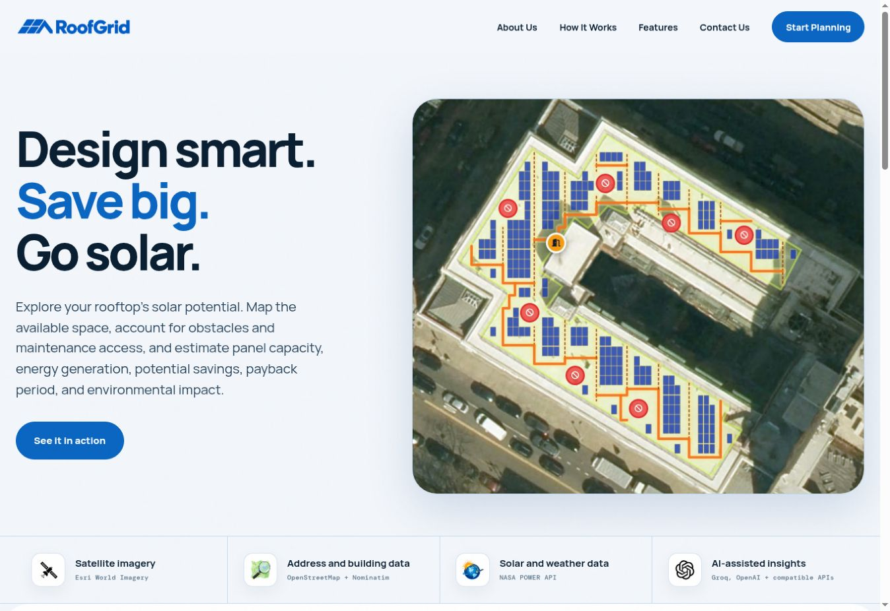
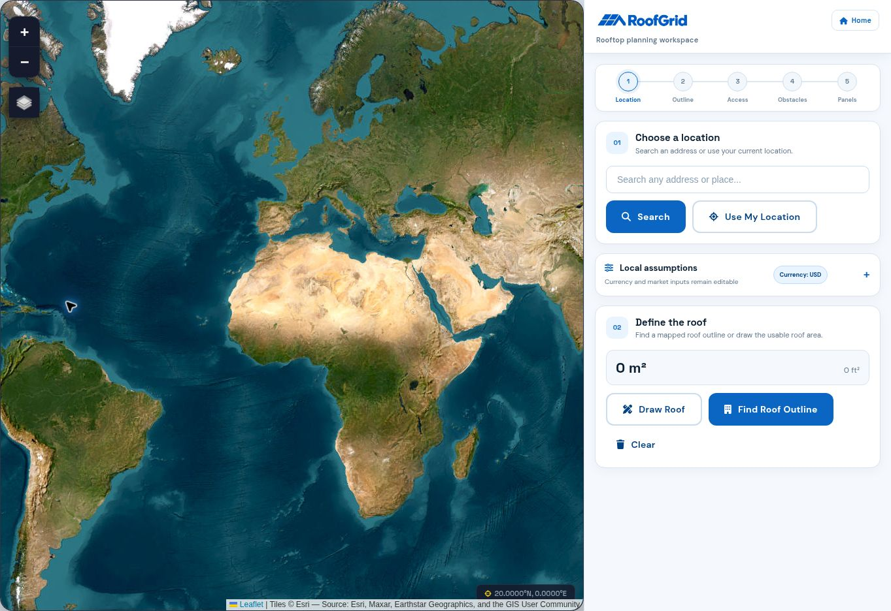
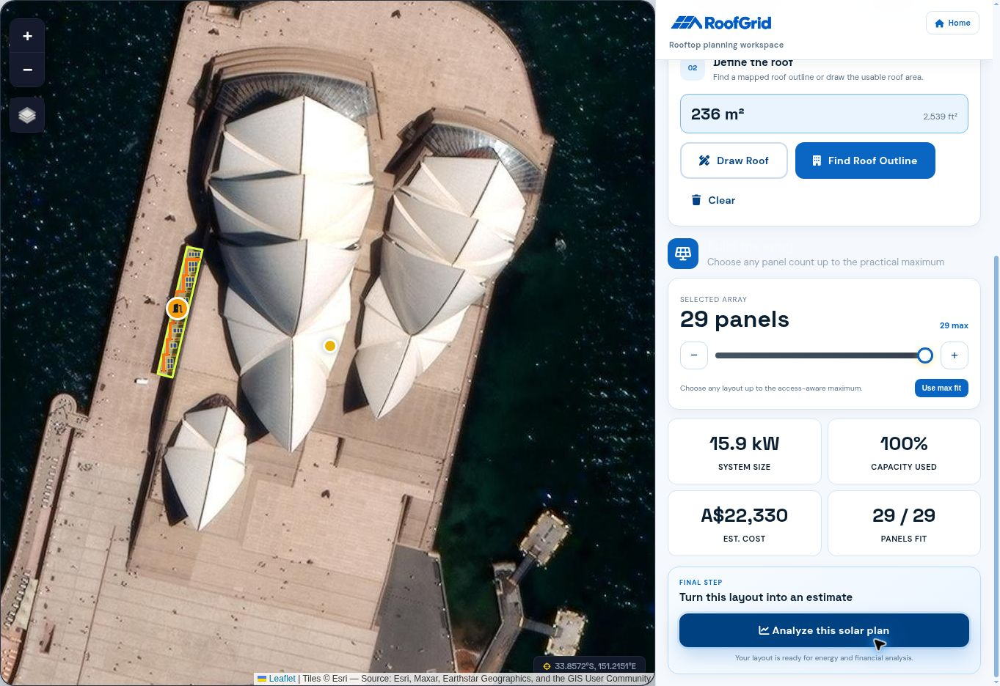
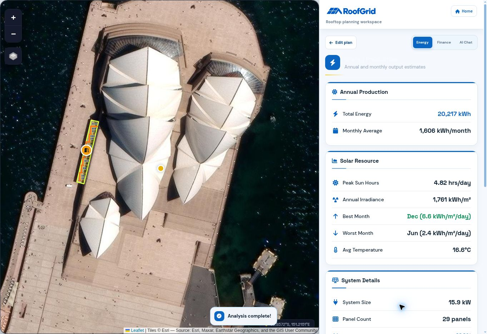
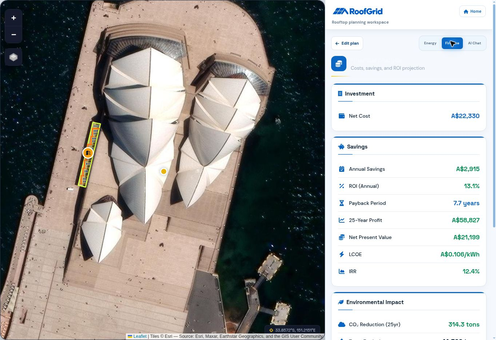
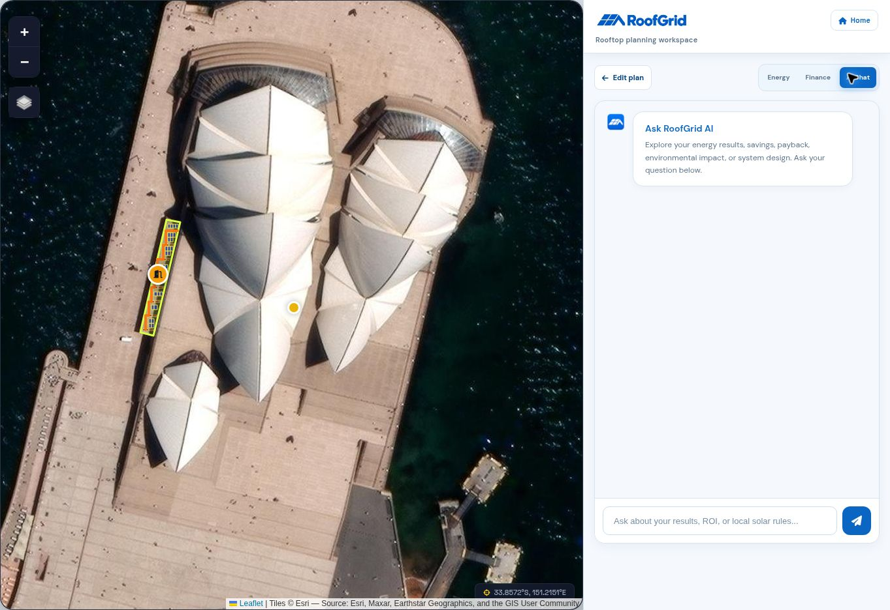

<p align="center">
  
</p>

<p align="center">
  <strong>Turn a real rooftop into a practical, access-aware solar plan.</strong>
</p>

<p align="center">
  Locate a roof, map usable space, place panels, and explore energy, financial, and environmental outcomes in one workflow.
</p>



## Why RoofGrid

Early solar estimates often start and end with a panel count. RoofGrid adds the real constraints that determine whether a rooftop plan is usable: roof geometry, access routes, maintenance space, obstacles, and editable local assumptions.

The result is an early-stage planning workspace that helps property owners, designers, students, and sustainability teams understand a roof's solar potential before moving to detailed engineering.

## From rooftop to decision

1. **Locate** — search globally, use your current location, or navigate directly on the satellite map.
2. **Define** — detect a building footprint or draw the usable roof boundary yourself.
3. **Plan** — reserve rooftop access and maintenance paths, mark obstacles, and configure the panel layout.
4. **Estimate** — review expected generation, system size, cost, savings, payback, and environmental impact.
5. **Explain** — use the optional AI assistant to explore results and identify questions for local professionals.

### Find and define a rooftop



### Optimize the panel layout



### Review energy potential



### Explore financial outcomes



### Ask questions about the plan



## Core capabilities

- Worldwide satellite mapping, address search, and GPS support
- OpenStreetMap building-footprint detection and manual roof drawing
- Access points, maintenance paths, and obstacle exclusion zones
- Configurable panel dimensions, spacing, orientation, and layout density
- NASA POWER solar-resource and temperature data with bundled regional fallbacks
- Editable currency, tariffs, export credit, installation cost, usage, and grid-emissions assumptions
- Energy, financial, and environmental estimates in one planning workspace
- Optional AI assistant (Groq on Vercel/local development, Amazon Bedrock on AWS) and downloadable PDF reports

## Environmental impact and the SDGs

RoofGrid is designed to support better early decisions about distributed solar. It can help users compare how much clean electricity a rooftop may generate, understand whether a layout is practical, and estimate avoided grid emissions using transparent, editable assumptions.

This work aligns with four United Nations Sustainable Development Goals:

| Goal | How RoofGrid contributes |
| --- | --- |
| [SDG 7 — Affordable and Clean Energy](https://sdgs.un.org/goals/goal7) | Makes rooftop renewable-energy potential easier to explore and supports informed investment in solar generation. |
| [SDG 11 — Sustainable Cities and Communities](https://sdgs.un.org/goals/goal11) | Helps evaluate existing urban rooftops as distributed-energy sites while accounting for safe access and maintainability. |
| [SDG 12 — Responsible Consumption and Production](https://sdgs.un.org/goals/goal12) | Encourages efficient use of available roof area and exposes the material, energy, and financial assumptions behind a proposed system. |
| [SDG 13 — Climate Action](https://sdgs.un.org/goals/goal13) | Estimates potential avoided emissions so users can compare rooftop solar scenarios as part of broader decarbonization planning. |

RoofGrid reports estimated annual and lifetime energy generation, avoided CO₂e, and simple environmental equivalents. These values are decision-support estimates—not audited carbon accounting, verified emissions reductions, or certification of SDG performance.

In practical terms, the planner helps quantify:

- how much of a roof can be used without ignoring access and obstacle constraints;
- the renewable electricity a proposed layout may produce;
- the share of local electricity use that solar could cover; and
- the potential emissions avoided under an editable grid-emissions assumption.

## How the estimates are built

| Area | Source or method |
| --- | --- |
| Map and geometry | Leaflet, Esri World Imagery, OpenStreetMap, and Turf.js |
| Solar resource | NASA POWER API with bundled regional fallback data |
| Layout | Browser-based geometry using the selected roof, exclusions, access path, and panel settings |
| Finance | User-editable cost, tariff, export-credit, usage, degradation, and discount assumptions |
| Environmental impact | Estimated generation multiplied by an editable grid-emissions factor |
| AI | Server-side chat: Groq for local/Vercel deployments and Amazon Bedrock GPT-OSS for AWS |

## Run locally

Requirements: Python 3.9 or newer and a modern browser.

```bash
git clone git@github.com:rohanmalhotracodes/roofgrid.git
cd roofgrid
cp .env.example .env.local
python3 server_local.py
```

Open <http://localhost:8000>. Use `server_local.py` rather than opening the HTML files directly because RoofGrid's AI, OpenStreetMap, contact, and NASA requests use private proxy routes.

### Environment variables

Only the relevant private values need to be added to `.env.local`:

```dotenv
GROQ_API_KEY=gsk_your_real_key
CONTACT_EMAIL=you@example.com
```

`GROQ_API_KEY` enables AI chat. `CONTACT_EMAIL` routes contact-form messages through FormSubmit; the recipient may need to confirm FormSubmit's one-time activation email. Provider, model, and other optional AI settings are documented in `.env.example`.

Never put real credentials in `.env.example`, frontend JavaScript, or any committed file. Restart the local server after changing `.env.local`.

## Deploy to Vercel

1. Import this repository into Vercel and select the **Other** framework preset.
2. Leave the build, output, and install commands empty; `vercel.json` contains the required routes.
3. Add `GROQ_API_KEY` and `CONTACT_EMAIL` under **Production and Preview** environment variables.
4. Add any optional AI provider or model variables described in `.env.example`.
5. Deploy again after adding or changing environment variables.

Keep these variables server-side. Do not prefix them with `NEXT_PUBLIC_` or expose them in browser code.

## Deploy to AWS

**Live AWS deployment:** https://main.d5qymiq46yhlb.amplifyapp.com

The AWS deployment runs the static site on **Amplify Hosting** and the existing `/api/*` routes on **API Gateway + Lambda**. RoofGrid AI uses **Amazon Bedrock** through the Lambda execution role, so no Groq API key or Bedrock API key is stored for the AWS deployment. The Vercel deployment remains separate and continues to use its existing Groq configuration.

### AWS services used

| Area | AWS service | How RoofGrid uses it |
| --- | --- | --- |
| AI | **Amazon Bedrock** | Runs the RoofGrid AI assistant using `openai.gpt-oss-120b-1:0` without storing an external AI API key. |
| Serverless | **AWS Lambda** | Executes the backend routes for AI, contact, NASA POWER, and OpenStreetMap/Overpass requests. |
| Serverless | **Amazon API Gateway** | Exposes the Lambda backend through the existing `/api/*` HTTP routes used by the browser. |
| Hosting | **AWS Amplify Hosting** | Deploys the static RoofGrid frontend from GitHub and provides the public production URL. |
| Data | **Amazon DynamoDB** | Stores the deployment-wide daily AI request counter used to cap Bedrock usage. |
| Observability | **Amazon CloudWatch** | Captures Lambda logs and runtime diagnostics for the AWS backend. |
| Secrets | **AWS Secrets Manager** | Stores the server-side contact recipient configuration. Bedrock itself uses IAM rather than an API key. |
| Security | **AWS Identity and Access Management (IAM)** | Gives Lambda least-privilege access to Bedrock, DynamoDB, and Secrets Manager. |
| Infrastructure as code | **AWS SAM + AWS CloudFormation** | Builds and deploys the Lambda, API Gateway routes, IAM policies, DynamoDB quota table, and related AWS resources. |

For the challenge categories shown in the AWS track, RoofGrid directly uses **Lambda + API Gateway** for Serverless, **Amplify Hosting** for deployment, **DynamoDB** for Data, and **CloudWatch** for observability/plumbing. The AI layer is implemented with **Amazon Bedrock**.

The production request path is:

```text
Browser
  ↓
AWS Amplify Hosting
  ↓
Amazon API Gateway
  ↓
AWS Lambda
  ├── Amazon Bedrock → RoofGrid AI
  ├── Amazon DynamoDB → daily AI quota
  ├── AWS Secrets Manager → private server configuration
  ├── NASA POWER API
  └── OpenStreetMap / Overpass API

CloudWatch records backend logs and diagnostics.
```

### 1. Store the contact setting

The AWS secret only needs the contact-form recipient:

```json
{
  "CONTACT_EMAIL": "you@example.com"
}
```

`aws/deploy.sh` creates or updates `roofgrid/config` automatically. Bedrock authentication is handled by IAM.

### 2. Deploy the API

From an authenticated AWS CloudShell or AWS CLI environment:

```bash
bash aws/deploy.sh
```

The helper will:

- create or update the `roofgrid/config` Secrets Manager secret;
- build the Lambda package with SAM;
- grant the Lambda role permission to invoke the configured Bedrock model;
- create a small DynamoDB table that enforces a deployment-wide daily AI request cap;
- apply API Gateway throttling to the AI routes;
- deploy API Gateway + Lambda through CloudFormation;
- run the `/api/health` check; and
- optionally configure the Amplify `/api/<*>` rewrite when you provide your Amplify app ID.

The default safeguards are **100 Bedrock requests per UTC day**, a **0.5 request/second** steady-state AI rate, and a **burst of 3**. They are configurable:

```bash
AWS_REGION=ap-southeast-2 \
AI_DAILY_REQUEST_LIMIT=100 \
AI_THROTTLE_RATE=0.5 \
AI_THROTTLE_BURST_LIMIT=3 \
ALLOWED_ORIGIN=https://your-amplify-domain.amplifyapp.com \
AMPLIFY_APP_ID=your-amplify-app-id \
bash aws/deploy.sh
```

The default Bedrock model is `openai.gpt-oss-120b-1:0`.

Or deploy manually:

```bash
cd aws
sam build
sam deploy --guided
```

SAM creates the Lambda function, HTTP API routes, Bedrock IAM permission, DynamoDB quota table, Secrets Manager permission, and CloudWatch logging.

When deployment finishes, confirm:

```text
https://YOUR_API_ID.execute-api.YOUR_REGION.amazonaws.com/api/health
```

and test AI through the unchanged endpoint:

```text
POST /api/ai
```

### 3. Deploy the site with Amplify Hosting

1. In Amplify Hosting, connect this GitHub repository and branch. This project is **not a monorepo**, so leave the monorepo option off.
2. Amplify reads the root `amplify.yml`.
3. Deploy the branch.
4. Keep the `/api/<*>` reverse proxy pointed at the API Gateway URL. The deployment helper can configure it automatically when `AMPLIFY_APP_ID` is provided.

The browser still calls `/api/ai`, `/api/contact`, `/api/nasa`, and `/api/overpass`; only the AWS AI implementation changes from Groq to Bedrock.

### Updating the AWS deployment

Amplify rebuilds the frontend after a push to its connected branch. Backend changes are deployed separately:

```bash
cd aws
sam build
sam deploy
```

The AWS and Vercel deployments can remain live at the same time. Vercel continues to use `vercel.json` and the handlers in `api/`; AWS uses `amplify.yml`, `aws/template.yaml`, and Amazon Bedrock.

## Planning limitations

- Satellite imagery and OpenStreetMap outlines may be incomplete, outdated, or misaligned.
- Production, cost, savings, payback, and emissions results depend on the assumptions entered by the user.
- Shade, structural capacity, electrical design, fire setbacks, permits, tariffs, and equipment availability require local verification.
- AI responses may be inaccurate and do not replace utility guidance, regulations, engineering, or professional advice.

RoofGrid is an exploration and planning tool—not an engineering design, structural assessment, permit set, installer quote, or carbon-accounting product.

## License

RoofGrid is available under the [MIT License](LICENSE).
